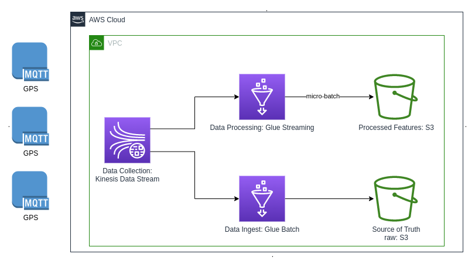

# Coding Challenges to Data Engineer
When I finished to read the Notion, I review my code, to understand if is the suitable with Joel Test and the Core Values.

### Changes
- Add tests
- Single Responsibility Principle
- I believe that this improvements follow with CORE VALUES (Expect Excellence + Simplify to Solve)

# Code Challenge
## Task 01: [detect_speeding_events()](app/detector.py)
I used the Template Method design pattern.
The `detect_speeding_events()` is a skeleton for this algorithm and the other functions provide the implementation.
 

NOTES:
- Pyspark instead of SparkSQL:
  - More flexible
  - Allow us way to store the intermediate results
- [New tests](test/test_detector.py)

## Task 02: [predict_speeding_event()](app/detector.py)
In this case SparkSQL is better to understand the answer because provides a more concise and readable code.
 

NOTES:
- The column names are defined as variables for improved code readability, making it easier to maintain the code if the column names change in the future.

# System Design
This is not a requirement, but I am considering a good architecture for the problem of **detecting events from GPS in real-time**. I am focusing on using AWS services, but if necessary, I am open to discussing other cloud providers or open-source technologies.

### Data Collection
Every data input is in a real-time stream and stored for a limited period of time.

### Data Processing & Processed Features
In this step, Spark Streaming, managed by AWS Glue, reads the data from Amazon Kinesis and executes micro-batch. The processed data is then stored in Amazon S3 as processed features.
 
These data can be consumed in near-real-time for the following purposes:
- Retraining the model using AWS Lambda and inputting the data into Amazon SageMaker
- Executing predictions and returning the results to the user using Amazon SageMaker Endpoint
- Analyzing the data using Amazon SageMaker notebooks

### Data Ingest & Source of Truth
In this step, I will store the original data into an Amazon S3 bucket (raw). This is necessary for audibility of the data and compliance with regulations that require the retention of original data for a certain period of time.
Additionally, the original data may be used for further analysis and as a backup.

### Other Suggest Services
- IaC: terraform
- Control Version: git using Github as remote server.
- Amazon IAM: to control the authentication and authorization of services and data.

---

Bruno Aurelio Rozza de Moura Campos
 
Data Engineer
 
Phone: +55 48 988310303
 
Email: brunocampos01@gmail.com
 
Linkedin: https://www.linkedin.com/in/brunocampos01/

---
